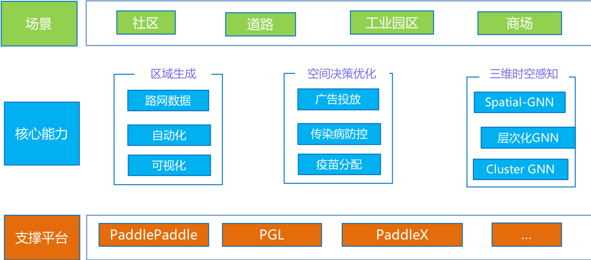

----------------------------------------------------
## 简介

PaddleSpatial是基于百度飞桨深度学习框架开发的时空大数据计算工具和平台，融合了百度领先的区域分割、时空迁移学习、时间序列预测等时空能力，可支持多种时空计算场景的应用。

## 安装指南

PaddleSpatial是一个基于高性能机器学习工具[PaddlePaddle飞桨](https://github.com/paddlepaddle/paddle)的时空大数据计算开源工具库。详细的安装和环境配置指引请查阅[这里](./installation_guide_cn.md)。

## 交流与反馈

* 欢迎您通过 [Github Issues](https://github.com/PaddlePaddle/PaddleSpatial/issues) 来提交问题、报告与建议

## 版本更新
更多版本更新说明请查看[ChangeLog](./docs/CHANGELOG.md)

## License

PaddleSpatial遵循[Apache-2.0开源协议](./LICENSE)。
