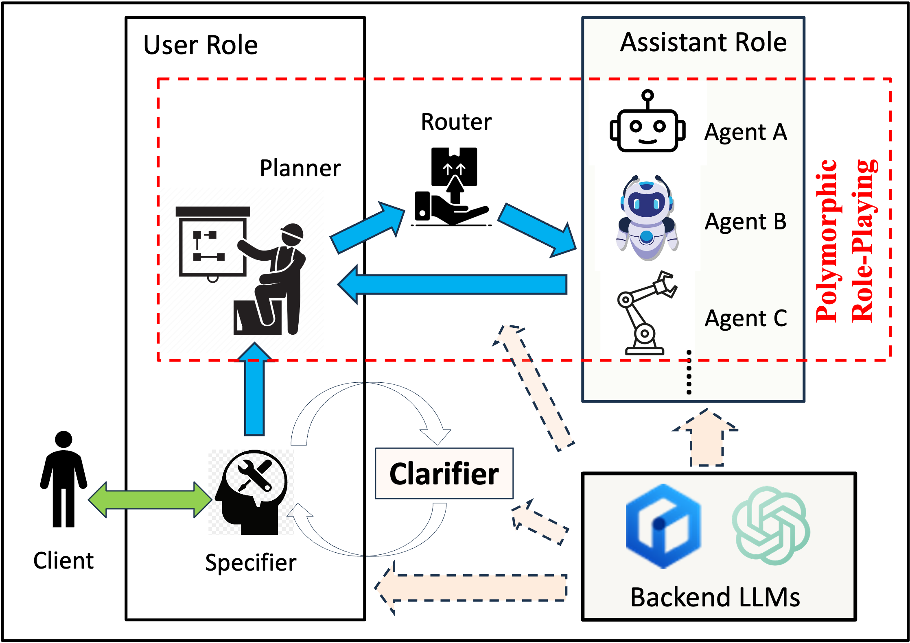

# ArcheAct: A Collaborative Agent Framework with MixAct and Disambiguaty

<div align="center">

  <a></a>
</div>

<p align="center">
  
</p>

## Overview
The rapid advancement of conversational and chat-based language models has led to remarkable progress in complex task-solving. 
However, their success heavily relies on human input to guide the conversation, which can be challenging and time-consuming. 
This work explores the potential of building scalable techniques to facilitate autonomous cooperation among communicative agents and provide insight into their "cognitive" processes. 
To address the challenges of achieving autonomous cooperation, we propose a novel communicative agent framework named *role-playing*. Our approach involves using *inception prompting* to guide chat agents toward task completion while maintaining consistency with human intentions. 
We showcase how role-playing can be used to generate conversational data for studying the behaviors and capabilities of chat agents, providing a valuable resource for investigating conversational language models. 
Our contributions include introducing a novel communicative agent framework, offering a scalable approach for studying the cooperative behaviors and capabilities of multi-agent systems, and open-sourcing our library to support research on communicative agents and beyond. 
The GitHub repository of this project is made publicly available on: [https://github.com/xxx/xxx](https://github.com/xxx/archeact).

## Try it yourself
We provide a 

## Documentation


## Installation


## Example


**For Bash shell (Linux, macOS, Git Bash on Windows):**

```bash
# Export your OpenAI API key
export ERNIE_BOT_ACCESS_TOKEN=<insert your EB Access Token>
```

**For Windows Command Prompt:**

```cmd
REM export your ErnieBot Access Token
set ERNIE_BOT_ACCESS_TOKEN=<insert your ErnieBot Access Token>
```

**For Windows PowerShell:**

```powershell
# Export your OpenAI API key
$env:ERNIE_BOT_ACCESS_TOKEN="<insert your ErnieBot Access Token>"
```

Replace `<insert your ErnieBot Access Token>` with your actual ErnieBot Access Token in each case. 
Make sure there are no spaces around the `=` sign.

After setting the OpenAI API key, you can run the script:

```bash
# You can change the role pair and initial prompt in role_playing.py
python apps/agents/agents_mixact.py
```

Please note that the environment variable is session-specific. 
If you open a new terminal window or tab, you will need to set the access token again in that new session.


## Use Open-Source Models as Backends


### Supported Models


## Data (Hosted on Hugging Face)


## Visualizations of Instructions and Tasks


## Implemented Research Ideas from Other Works


## News
- 

## Citation
```

```
## Acknowledgement


## License

The intended purpose and licensing of ArcheAct is solely for research use.

The source code is licensed under Apache 2.0.

The datasets are licensed under CC BY NC 4.0, which permits only non-commercial usage. 
It is advised that any models trained using the dataset should not be utilized for anything other than research purposes.

## Contributing to  🐫
We appreciate your interest in contributing to our open-source initiative. 


## Contact
For more information please contact 
