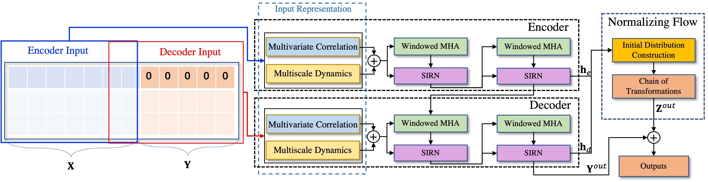

## Introduction

This code corresponds to the [PaddlePaddle](https://www.paddlepaddle.org.cn/en) implementation of the paper "Towards Long-Term Time-Series Forecasting: Feature, Pattern, and Distribution".


We propose a long-term time-series forecasting model, named Conformer.
The framework overview of the proposed Conformer is as follows:



If you find this code or any of the ideas in the paper useful, please cite:

```bibtex
@inproceedings{li2023towards,
author = {Li, Yan and Lu, Xinjiang and Xiong, Haoyi and Tang, Jian and Su, Jiantao and Jin, Bo and Dou, Dejing},
title = {Towards Long-Term Time-Series Forecasting: Feature, Pattern, and Distribution},
year = {2023},
publisher = {IEEE},
booktitle = {Proceedings of the 39th IEEE International Conference on Data Engineering},
location = {Anaheim, California, USA},
series = {ICDE '23}
}
``` 


### NOTE

* The experimental result reported in the paper is implemented on top of the PyTorch version. 
In the implementation of PaddlePaddle version, we employ the same setup as reported in the paper,
the forecast performance of this version is different from the result reported in the paper.

* Further parameter tuning is required to obtain comparable performance.

* Both the sliding-window attention and full attention are supported in this implementation.

* The installation of the PaddlePaddle framework can refer to 
[this link](https://www.paddlepaddle.org.cn/documentation/docs/en/install/index_en.html).


## Requirement

* Python >= 3.6
* matplotlib ~= 3.1.1
* numpy >= 1.19.4
* pandas >= 0.25.1
* scikit_learn ~= 0.21.3
* paddlepaddle ~= 2.2.2

Dependencies should be installed using the following command before training:
`
    pip install -r requirements.txt
`

## Data Preparation

Change the **$root_path** and **$data_path** if necessary. 
This code can only support **.csv** format right now. 

The public datasets used in this paper are listed as follows.

***Electricity:*** https://archive.ics.uci.edu/ml/datasets/ElectricityLoadDiagrams20112014

***Traffic:*** http://pems.dot.ca.gov

***Weather:*** https://www.bgc-jena.mpg.de/wetter/

***Exchange_rate*** https://github.com/laiguokun/multivariate-time-series-data

***ETTs:*** https://github.com/zhouhaoyi/ETDataset

Besides, two collected datasets can be found here: i.e.,
[WindPower](../../paddlespatial/datasets/WindPower) and [AirDelay](../../paddlespatial/datasets/AirDelay).


## Usage

You can train the model with the following commands 
(some options, like `--root_path` and `--pred_len`, need to be configured in advance).

```
# weather
python -u train.py  --data WTH --root_path $1 --pred_len $2

# electricity
python -u train.py  --data ECL --root_path $1 --pred_len $2

# exchange_rate
python -u train.py  --data EXCH --root_path $1 --pred_len $2

# ETTm1
python -u train.py  --data ETTm1 --root_path $1 --pred_len $2

# ETTh1
python -u train.py  --data ETTh1 --root_path $1 --pred_len $2

```


## Parameter Descriptions

### The parameters related to the model architecture

The proposed 'Conformer' contains three main components, 
the parameters of model architecture are as follows.

| Params            | Description                                                        |
|:------------------|:-------------------------------------------------------------------|
| --e_layers        | number of encoder layer                                            |
| --d_layers        | number of decoder layer                                            |
| --enc_lstm        | number of lstm used in encoder                                     |
| --dec_lstm        | number of lstm used in decoder                                     |
| --normal_layer    | the number of normalizing flow layers                              |
| --d_model         | the embedding dimension                                            |
| --n_head          | the number of attention head                                       |
| --window          | the window size of sliding window attention                        |
| --weight          | the weight between the decoder output and normalizing flow results |


### Experiment settings

The parameters that used for experiments.

| Params        | Description                                         |
|:--------------|:----------------------------------------------------|
| --feature     | forecasting tasks,including [M, S, MS]              |
| --freq        | frenquency of time series                           |
| --target      | target feature when the forecasting task is MS or S |
| --seq_len     | the length of input sequence                        |
| --label_len   | token length of decoder input                       |
| --pred_len    | the prediction length                               |
| --enc_in      | the dimension of encoder input                      |
| --dec_in      | the dimension of decoder input                      |
| --c_out       | the dimension of output                             |
| --checkpoints | the path to save the checkpoints                    |
| --root_path   | the root path of files                              |
| --data_path   | 


### Training settings 

The parameters that used for training the model.

| Params          | Description                   |
|:----------------|:------------------------------|
| --learning_rate | the learning of optimizer     |
| --batch_size    | the batch size of input data  |
| --train_epochs  | the number of training epoch  |
| --itr           | the repeated experiment times |
| --loss          | the loss function type        |


