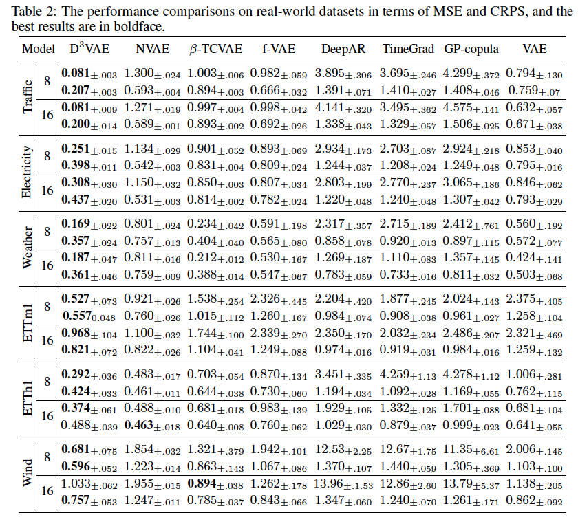
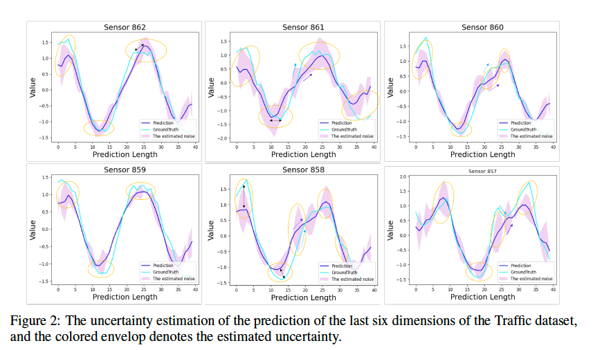

# D3VAE (Implemented with PyTorch)


## Installation
This version of $D^3VAE$ is implemented with Python 3.8 and torch 1.11.0, 
run the following command to install the required dependencies.
   
```
pip install -r requirements.txt
```


## Results

The reported experimental results can be found below. 



### Forecasting Results with Uncertainty Awareness 




