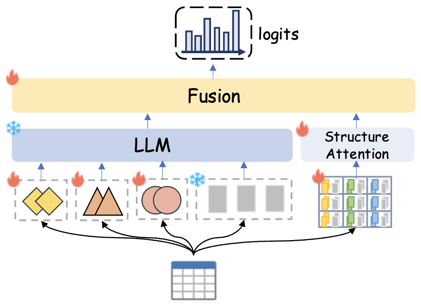

## Introduction

This code corresponds to the [PaddlePaddle](https://www.paddlepaddle.org.cn/en) implementation of the paper "Visualization Recommendation with Prompt-based Reprogramming of  Large Language Models" (ACL2024).


## Requirements

Run the following command to install the required dependencies.

```python
pip install -r requirements.txt
```

## Data Preparation

1. **Download dataset.** We utilize the collected table-chart pairs dataset and the image dataset, which are listed as follows:
   - [table-chart pair dataset](https://drive.google.com/file/d/1xyxSr41B_dtH7LmKh9pD2X1VcgtYgn28/view?usp=sharing) please download the raw data and extract the .tsv file to ./data.
   - [image dataset](https://drive.google.com/file/d/1hqVXHiYbi42Wz8X3vQjZtMcpOEWR7z6_/view?usp=sharing) please download the raw data and extract the image folder to ./hard_code.
2. **Download model state**. please download the [model_state](https://drive.google.com/file/d/1pNmEdjryTbrcmIrQHqQMaKhBzF7hEzYq/view?usp=sharing) and move the .pdparams file to ./bloomModel.
3. **Prepare hard code.** under ./hard_code: 
   - `python get_clip_feature.py` get image features
   - `python train_contrast.py` train the contrast learning model
   - `python get_hard_code.py` get final hard_code
4. **Prepare cluster index.** under ./cluster_prompt: 
   - `python get_table_feature.py` get table features
   - `python cluster.py` cluster table features
5. **Prepare input data.** under ./data_preprocess
   - `python parse_data.py` parse data from raw data
   - `python pre_input_data.py` linearize table and chart data and divide the dataset

## Usage

Set hyper-parameters in the file train.json and bloomModel/config.json, and then train HTP by:

```python
sh train.sh
```

Set hyper-parameters in the file generate.json and bloomModel/config.json, and then test HTP by:

```python
sh generate.sh
```


