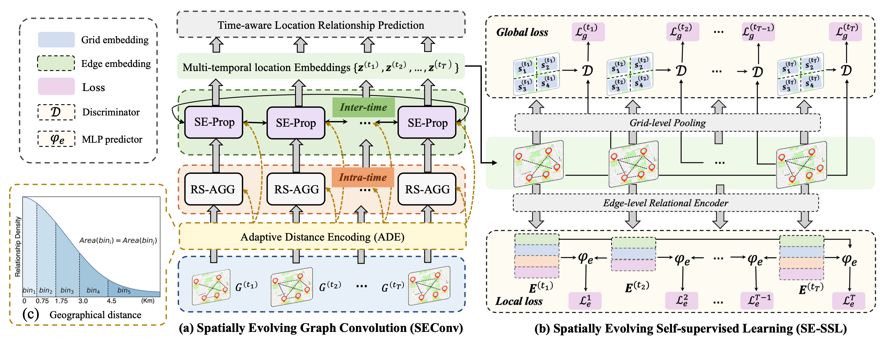

## SEENet-Paddle
Source code for KDD 2023 paper: "Multi-Temporal Relationship Inference in Urban Areas".
<p align="center">
  
  <br />
</p> 

### Dependencies

- python >= 3.8
- paddlepaddle >= 2.4.1
- pgl >= 2.2.4


### Datasets
The constructed open-source relationship datasets (Tokyo, New York, and Chicago) are available in https://github.com/agave233/SEENet/tree/master/data

The raw data of different cities can be downloaded as follows:

[Check-in data of Foursquare (Tokyo)](https://sites.google.com/site/yangdingqi/home/foursquare-dataset)

[Taxi trajectory data (New York)](https://nyc.gov/site/tlc/about/tlc-trip-record-data.page)

[Bike-riding data from Divvy (Chicago)](https://ride.divvybikes.com/system-data)

The downloaded data should be preprocessed to generate the business-based relationship dataset (Business-RD) and the mobility-based relationship dataset (Mobi-RD) for locations, respectively:

Then run the preprocessing code for SEENet model:
```
python preprocess/run_Business_RD.py.py --input_data RAW_DATA_PATH --output_path YOUR_OUTPUT_PATH
```

### How to run
The model is first pre-trained with our self-supervised learning:
```
python train_ssl.py --dataset DATASET --local-weight LOCAL_W --global-weight GLOBAL_W --global-batch-size BATCH_SIZE
```

Then the model loads the pre-trained file and performs the inference:
```
python train_trial.py --dataset DATASET --pretrain-path MODEL_PATH
```

We provide the running script for different datasets with specific parameters:
```
bash run.sh
```

If you have any question, please contact Shuangli Li by email: lsl1997@mail.ustc.edu.cn.